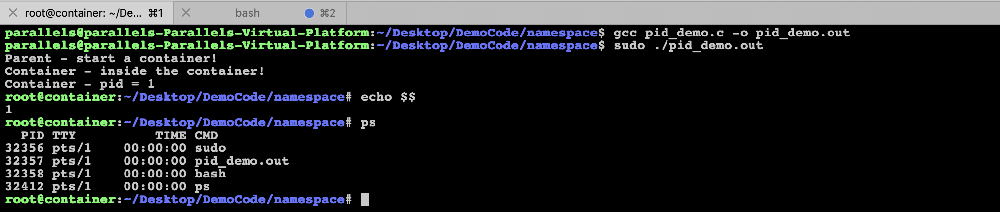
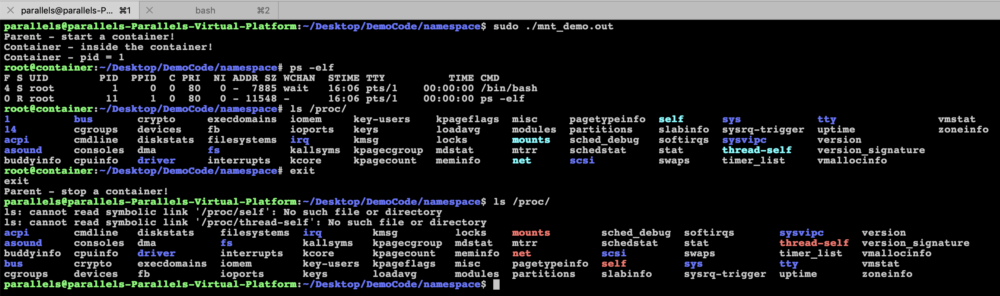

## 官方文档

https://lwn.net/Articles/531114/


主要是三个系统调用配合使用

* clone() - 实现进程的系统调用, 用来创建一个新的进程, 并可以通过设置参数(CLONE_NEWNS[mount namespace], CLONE_NEWUTS[uts namespace], CLONE_NEWIPC[ipc namespace], CLONE_NEWPID[pid namespace], CLONE_NET[net namespace], CLONE_NEWUSER[user namespace])达到隔离
* unshare() - 使某进程脱离某个namespace
* setns() - 把某进程加入到某个namespacez


## clone

clone_demo.c

```c
#define _GNU_SOURCE
#include <sched.h>
#include <sys/types.h>
#include <sys/wait.h>
#include <stdio.h>
#include <stdlib.h>
#include <signal.h>
#include <unistd.h>
#include <string.h>

// 定义一个给clone用的栈, 栈大小为1M
#define STACK_SIZE (1024*1024)
static char container_stack[STACK_SIZE];

char* const container_args[] = {
    "/bin/bash",
    NULL
};

int container_main()
{
    printf("Container - inside the container!\n");
    // 直接执行一个shell, 以便我们观察这个进程空间里的资源是否被隔离
    execv(container_args[0], container_args);
    printf("Shouldn't be here!\n");
    return 1;
}

int main(int argc, char *argv[])
{
    printf("Parent - start a container!\n");
    // 调用clone函数, 其中传入一个函数, 还有一个栈空间的地址(为什么传尾指针, 因为栈是反着的)
    int container_pid = clone(container_main, container_stack+STACK_SIZE, SIGCHLD, NULL);
    // 等待子进程结束
    waitpid(container_pid, NULL, 0);
    printf("Parent - stop a container!\n");
    return 0;
}
```


## UTS Namespace

uts_demo.c

```c
#define _GNU_SOURCE
#include <sched.h>
#include <sys/types.h>
#include <sys/wait.h>
#include <stdio.h>
#include <stdlib.h>
#include <signal.h>
#include <unistd.h>
#include <string.h>

// 定义一个给clone用的栈, 栈大小为1M
#define STACK_SIZE (1024*1024)
static char container_stack[STACK_SIZE];

char* const container_args[] = {
    "/bin/bash",
    NULL
};

int container_main()
{
    printf("Container - inside the container!\n");
    sethostname("container", 10); // 设置hostname
    // 直接执行一个shell, 以便我们观察这个进程空间里的资源是否被隔离
    execv(container_args[0], container_args);
    printf("Shouldn't be here!\n");
    return 1;
}

int main(int argc, char *argv[])
{
    printf("Parent - start a container!\n");
    // 调用clone函数, 其中传入一个函数, 还有一个栈空间的地址(为什么传尾指针, 因为栈是反着的)
    int container_pid = clone(container_main, container_stack+STACK_SIZE, 
        CLONE_NEWUTS | SIGCHLD, NULL);
    // 等待子进程结束
    waitpid(container_pid, NULL, 0);
    printf("Parent - stop a container!\n");
    return 0;
}
```


* CLONE_NEWUTS需要root权限才能运行
* 子进程的hostname变成了container


## IPC Namespace

ipc_demo.c

```c
#define _GNU_SOURCE
#include <sched.h>
#include <sys/types.h>
#include <sys/wait.h>
#include <stdio.h>
#include <stdlib.h>
#include <signal.h>
#include <unistd.h>
#include <string.h>

// 定义一个给clone用的栈, 栈大小为1M
#define STACK_SIZE (1024*1024)
static char container_stack[STACK_SIZE];

char* const container_args[] = {
    "/bin/bash",
    NULL
};

int container_main()
{
    printf("Container - inside the container!\n");
    sethostname("container", 10); // 设置hostname
    // 直接执行一个shell, 以便我们观察这个进程空间里的资源是否被隔离
    execv(container_args[0], container_args);
    printf("Shouldn't be here!\n");
    return 1;
}

int main(int argc, char *argv[])
{
    printf("Parent - start a container!\n");
    // 调用clone函数, 其中传入一个函数, 还有一个栈空间的地址(为什么传尾指针, 因为栈是反着的)
    int container_pid = clone(container_main, container_stack+STACK_SIZE, 
        CLONE_NEWUTS | CLONE_NEWIPC | SIGCHLD, NULL);
    // 等待子进程结束
    waitpid(container_pid, NULL, 0);
    printf("Parent - stop a container!\n");
    return 0;
}
```


## PID namespace

pid_demo.c

```c
#define _GNU_SOURCE
#include <sched.h>
#include <sys/types.h>
#include <sys/wait.h>
#include <stdio.h>
#include <stdlib.h>
#include <signal.h>
#include <unistd.h>
#include <string.h>

// 定义一个给clone用的栈, 栈大小为1M
#define STACK_SIZE (1024*1024)
static char container_stack[STACK_SIZE];

char* const container_args[] = {
    "/bin/bash",
    NULL
};

int container_main()
{
    printf("Container - inside the container!\n");
    printf("Container - pid = %ld\n", (long)getpid());
    sethostname("container", 10); // 设置hostname
    // 直接执行一个shell, 以便我们观察这个进程空间里的资源是否被隔离
    execv(container_args[0], container_args);
    printf("Shouldn't be here!\n");
    return 1;
}

int main(int argc, char *argv[])
{
    printf("Parent - start a container!\n");
    // 调用clone函数, 其中传入一个函数, 还有一个栈空间的地址(为什么传尾指针, 因为栈是反着的)
    int container_pid = clone(container_main, container_stack+STACK_SIZE, 
        CLONE_NEWUTS | CLONE_NEWIPC | CLONE_NEWPID | SIGCHLD, NULL);
    // 等待子进程结束
    waitpid(container_pid, NULL, 0);
    printf("Parent - stop a container!\n");
    return 0;
}
```





子进程pid是1, getpid()和echo $$看到的都是1, 但是ps看到则是32357, 因为ps和top是读/proc文件系统, 因为/proc文件系统在父进程和子进程都是一样, 所以这些命令会看到在父进程空间中的子进程pid


## Mount Namespace

mnt_demo.c

```c
#define _GNU_SOURCE
#include <sched.h>
#include <sys/types.h>
#include <sys/wait.h>
#include <stdio.h>
#include <stdlib.h>
#include <signal.h>
#include <unistd.h>
#include <string.h>

// 定义一个给clone用的栈, 栈大小为1M
#define STACK_SIZE (1024*1024)
static char container_stack[STACK_SIZE];

char* const container_args[] = {
    "/bin/bash",
    NULL
};

int container_main()
{
    printf("Container - inside the container!\n");
    printf("Container - pid = %ld\n", (long)getpid());
    sethostname("container", 10); // 设置hostname
    system("mount -t proc proc /proc");
    // 直接执行一个shell, 以便我们观察这个进程空间里的资源是否被隔离
    execv(container_args[0], container_args);
    printf("Shouldn't be here!\n");
    return 1;
}

int main(int argc, char *argv[])
{
    printf("Parent - start a container!\n");
    // 调用clone函数, 其中传入一个函数, 还有一个栈空间的地址(为什么传尾指针, 因为栈是反着的)
    int container_pid = clone(container_main, container_stack+STACK_SIZE, 
        CLONE_NEWUTS | CLONE_NEWIPC | CLONE_NEWPID | CLONE_NEWNS | SIGCHLD, NULL);
    // 等待子进程结束
    waitpid(container_pid, NULL, 0);
    printf("Parent - stop a container!\n");
    return 0;
}
```





通过CLONE_NEWNS创建新的mount namespace后, 父进程会把自己的文件结构复制给子进程中. 而子进程中新的namespace中得所有mount操作都只影响自身的文件结构, 而不对外界产生任何影响


__Parallels ubuntu 18.04 似乎/proc就坏掉了. 没有所有进程号相关的文件了.__


## User Namespace


